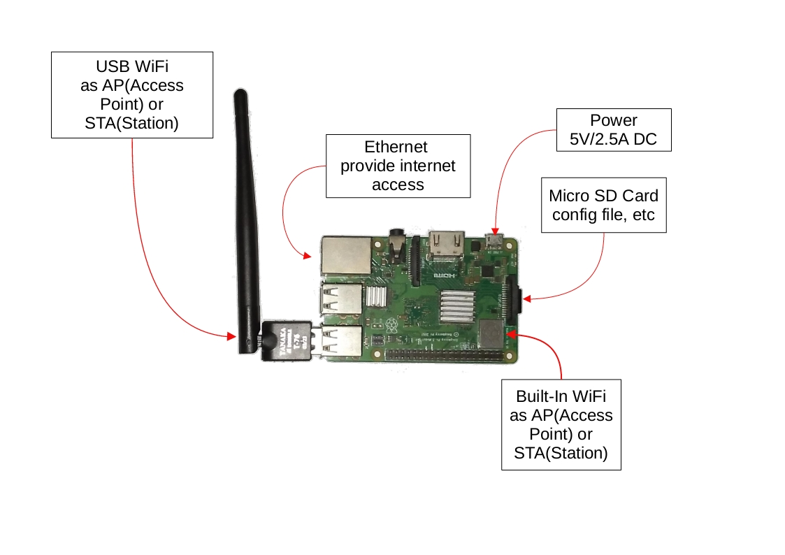
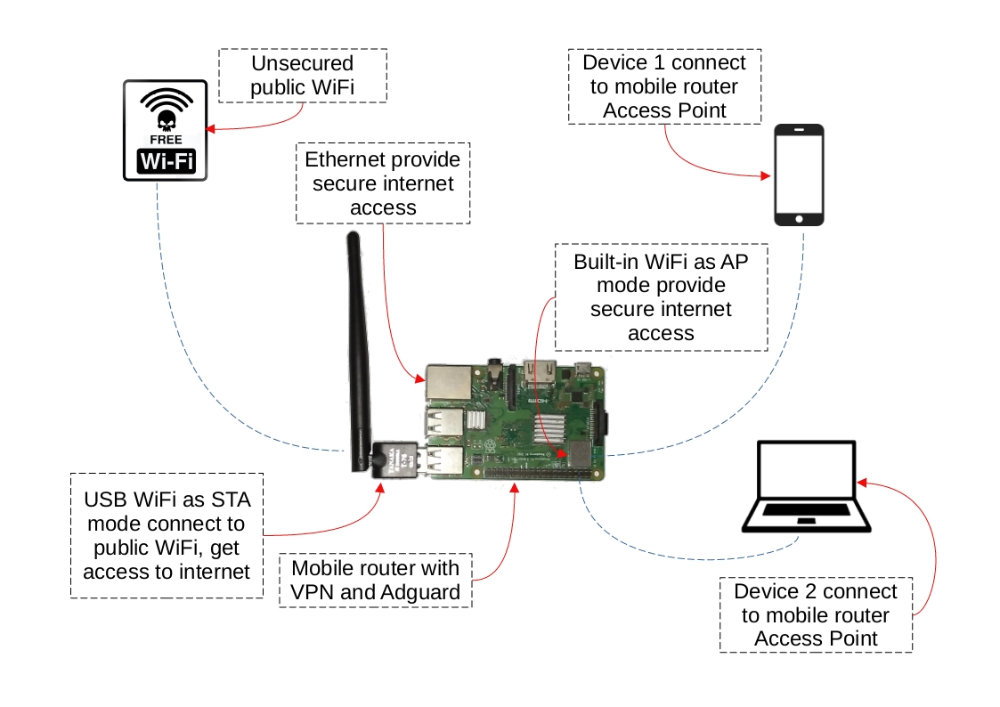

# Raspberry Pi Mobile Router with OpenWRT

This project use Raspberry Pi 3 with OpenWRT to make a secure network while
connected to public WiFi. Using Wireguard as VPN tunnel and AdguardHome as
ad block.

## Hardware Requirement

* Raspberry Pi 3/4(recommended)
* MicroSD card for OpenWRT and bunch of config file.
* USB WiFi(this project use Ralink 7601u WiFi chipset)
* Power adaptor or power bank

## Mobile Router Components



## How Mobile Router Works



## Install USB WiFi(MT7601u) Dependencies

For this project I use USB WiFi with chipset MT7601u

```sh
opkg update
opkg install kernel kmod-mac80211 kmod-usb-core mt7601u-firmware kmod-mt7601u
```

## Config File

Three important config file basic setup links /etc/config

* [Network](https://openwrt.org/docs/guide-user/base-system/basic-networking
"Network setup basic")

* [Wireless](https://openwrt.org/docs/guide-user/network/wifi/basic
"Wireless setup basic")

* [Firewall](https://openwrt.org/docs/guide-user/firewall/firewall_configuration
"Firewall setup")

## References

* [Build Raspberry Pi Router](https://www.youtube.com/watch?v=jlHWnKVpygw
"SUPER secure Raspberry Pi Router wifi VPN travel router")
* [Wireguard setup](https://www.youtube.com/watch?v=04q41GEPvKA
"How To Set Up A VPN On A Router // Wireguard on OpenWrt")
* AdguardHome [installation](https://openwrt.org/docs/guide-user/services/dns/adguard-home#installation
"AdguardHome Installation")
  * AdguardHome [setup](https://openwrt.org/docs/guide-user/services/dns/adguard-home#setup_agh_through_the_web_interface
  "Setup Through The Web Interface")
